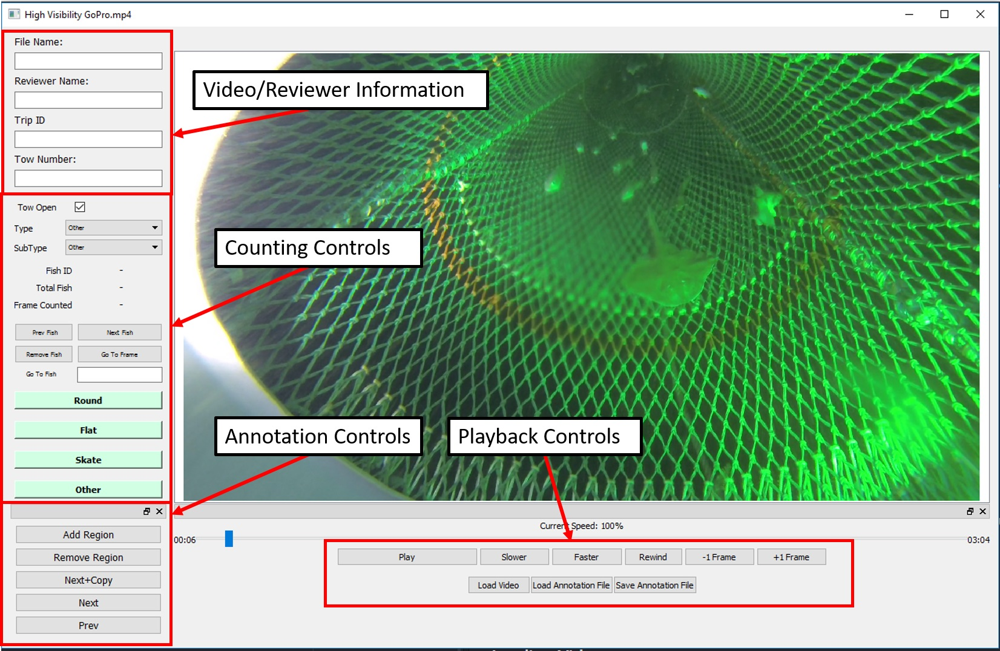

FishDetector User Manual                                  {#manual}
========================
<a name="Introduction"/>
# Introduction

Welcome to the Fish Annotation tool! This guide will give you all the information you need to get started annotating video files.  

### Table of Contents
 
[Introduction](#introduction)  
[The GUI](#the-gui)  
[Loading Video Files](#loading-and-viewing-video-files)  
[Loading Annotation Files](#loading-annotation-files)  
[Adding Fish](#adding-fish)  
[Deleting Fish](#deleting-fish)    
[Annotations](#annotations)  

<a name="the-gui"/>
# The GUI

This section gives an overview of the Graphical User Interface (GUI) that is used in the annotation tool. Each piece of the GUI will be highlighted, and the general functionality explained. In the following sections, using the GUI to accomplish specific actions will be covered. The figure below points out the major sections of the GUI.

<a name="loading-and-viewing-video-files"/>
# Loading and Viewing Video Files

### Loading Videos

The first step in any annotation procedure is to load the video file into the software. This is accomplished by pressing the Load Video button, located on the bottom part of the GUI. Depending on video size, it may take a little while to load the video.

### Viewing Videos

The playback controls located near the bottom of the GUI allow you to move through the video in a variety of ways. The most simple is to simply hit play and the video will play at the default speed. Using the speed up or slow down buttons, you can increase or decrease the playback speed respectively. For finer control the +1 Frame and -1 Frame buttons will allow you to move through the video on a frame by frame basis. This is useful during annotation.

<a name="loading-annotation-files"/>
# Loading annotation files
If you are reviewing an already annotated file, or resuming a previously started annotation session, you can load a saved annotation file, and edit or add to it. The Load Annotation File button allows you to choose an annotation file to load. **WARNING: Be sure that the file you load corresponds to the video you have loaded, or the annotations will not line up, and it could potentially crash the software**

<a name="adding-fish"/>
# Adding fish
In order to add a fish to the list of fish to be counted and/or annotated, use one of the four buttons: Round, Flat, Skate, or Other. This will add an entry to the fish annotation list, and this fish can then have annotation boxes associated with it. After choosing the initial type, you can also choose the subtype of the fish from the SubType drop down menu. Displayed below the type and subtype of the fish are the Fish ID, the total number of fish that have been annotated, and the frame that the currrent fish was first counted. You can navigatee through the list by pressing the Prev Fish or Next Fish buttons, and jump to the frame where the currently shown fish in the list was counted by pressing the Go To Frame button.

<a name="deleting-fish"/>
# Deleting Fish
You can delete a fish (and any annotations associated with it) by pressing the Remove Fish button when the ID of the fish you wish to delete is displayed in the Counting Controls area.

<a name="annotations"/>
# Annotations
This section will cover the creating of annotation bounding boxes, as well as how to delete them.
## Creating Annotations
Once a fish has been added to the list, you can start adding annotations for it in every frame that it is present. This is accomplished by pressing the Add Region button in the Annotation Controls section. This will create a bounding box, initialized to the upper left portion of the screen, that you can drag and resize so that it encompasses the fish it is associated with. Once you have put an initial bounding box associated with a fish, there are multiple ways to add bounding boxes to all of the other frames that it is present. One way is to use the playback controls to move forward by a frame, and then click the Add Region button again. However, an easier method is to use the Next+Copy button. This will advance the video by one frame, and then copy the bounding box from the previous frame. This may be easier, as often the fish do not move far in one frame, and so only minor resizing and moving may be necessary to annotate the next frame. **IMPORTANT: All of the annotation controls are associated with the fish who's ID is currently being displayed.  Therefore if you add a fish, and then browse the list, make sure that you navigate back to the fish you wish to annotate before starting to add bounding boxes, otherwise the boxes will be associated with an ID that was not intended.**

## Deleting Annotations
In order to delete a specific annotation in a frame, make sure that the ID of the fish you wish to delete the annotation for is displayed in the Counting Controls area, and then press the remove region button. This will delete the bounding box for the current frame only. If you wish to

## Saving annotations
